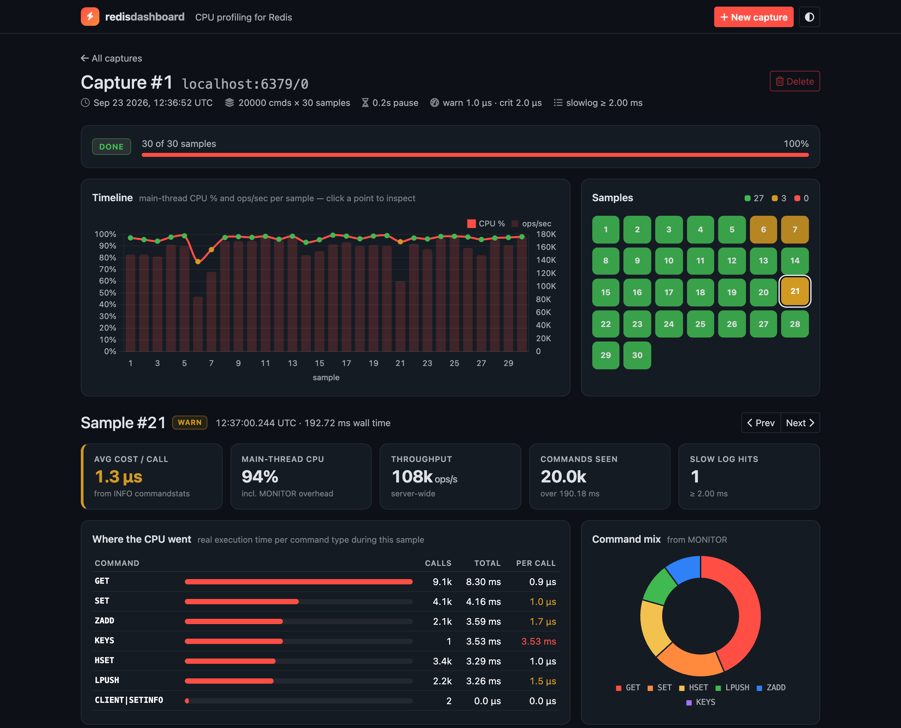
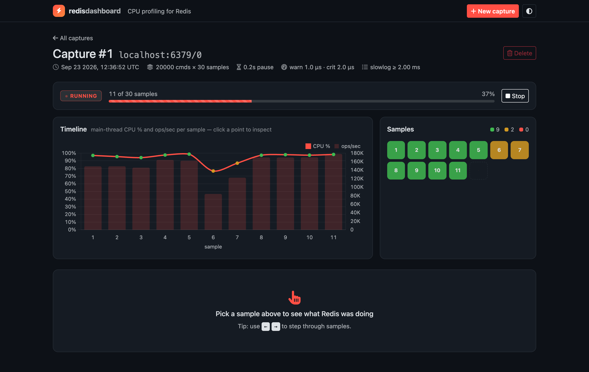
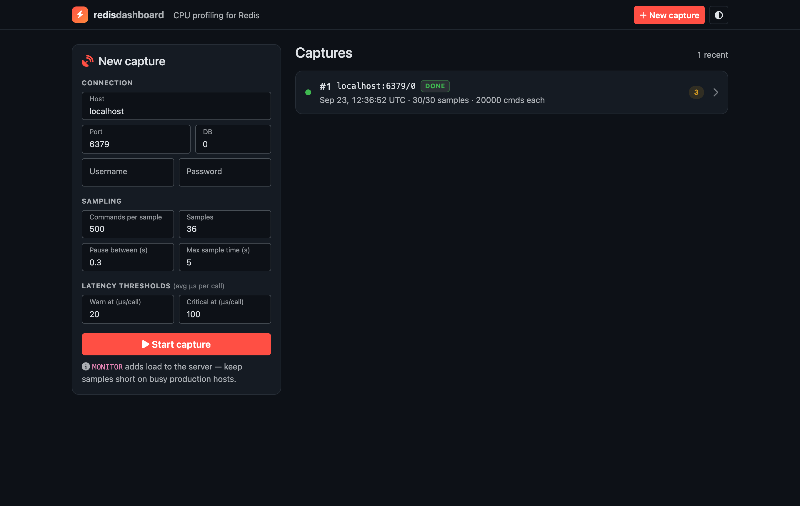
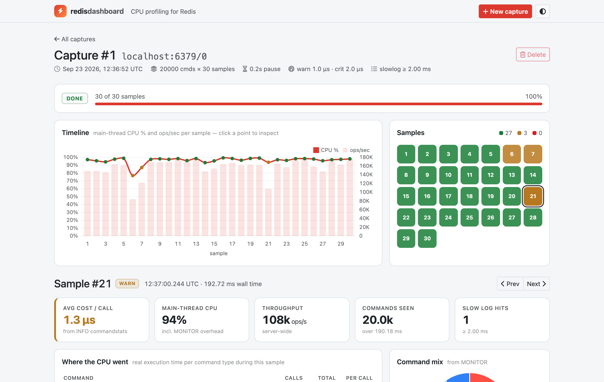
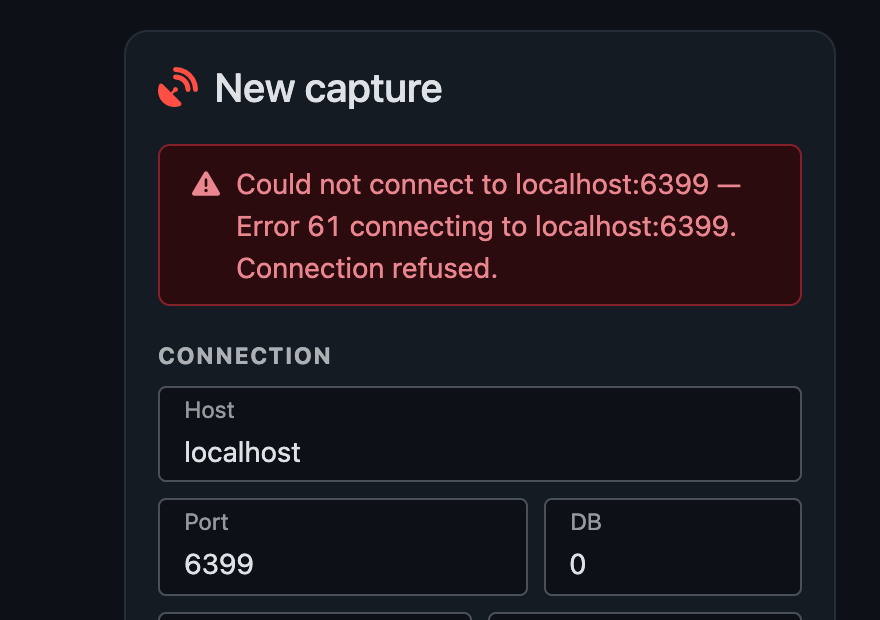
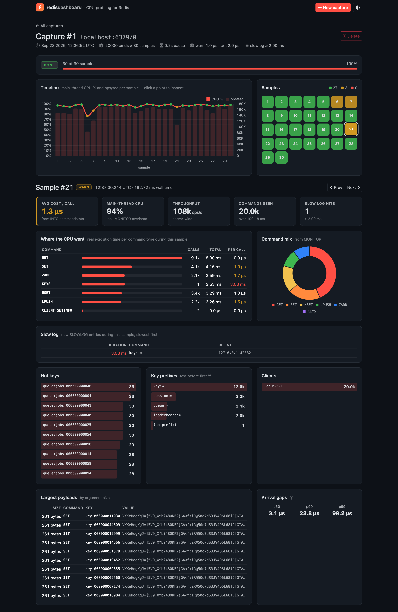
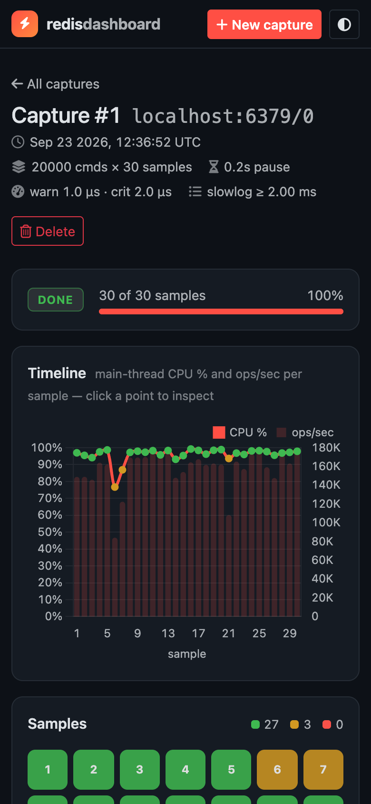
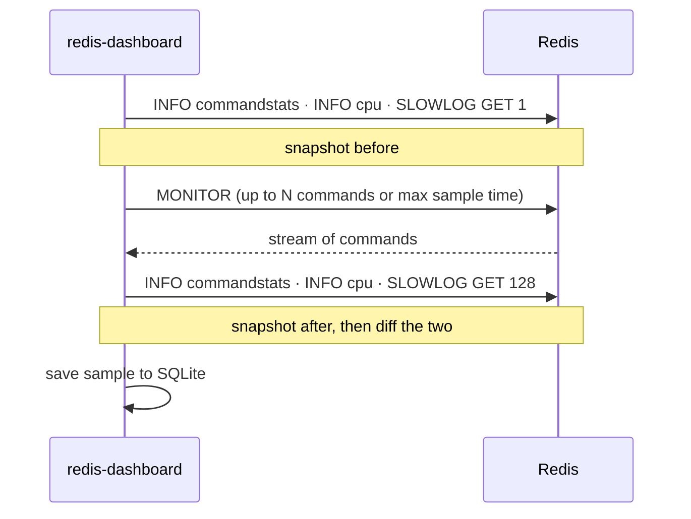

<div align="center">

# ⚡ redis-dashboard

**Find out what's burning your Redis CPU, in minutes rather than hours of scrolling through `MONITOR`.**

[](https://github.com/yonatan-ess/redis-dashboard/actions/workflows/tests.yml)
[](https://www.python.org/)
[](https://www.djangoproject.com/)
[](https://redis.io/)
[](LICENSE)



</div>

## Why

Your Redis host is at 100% CPU. The usual next step is `redis-cli MONITOR`, and then you're watching thousands of lines per second scroll past, trying to spot a pattern.

**redis-dashboard** does that watching for you. It takes a series of short samples and shows, for each one:

- **Which commands are eating CPU time**, measured by Redis itself.
- **How busy the main thread is**, which is the one that saturates first.
- **Which individual commands were slow**, from the slow log.
- **Who's sending what**: hot keys, key prefixes, clients and largest payloads.

It's a small local web app. Point it at a Redis instance, press **Start capture**, and watch the samples come in.

## Features

- 📈 **Timeline:** main-thread CPU % and ops/sec for every sample. Click a point to open that sample.
- 🟩 **Sample tiles** colored by average µs per call, with warn and critical thresholds you set per capture, since normal latency varies between environments.
- 🔥 **Where the CPU went:** real execution time per command type (calls, total, per call).
- 🐢 **Slow log:** the `SLOWLOG` entries recorded during each sample, slowest first.
- 🔑 **Traffic breakdown:** hot keys, key prefixes (`user:*`, `session:*`, …), clients, command mix and largest payloads.
- ⏯️ **Live captures** with progress, stop and delete. Captures are kept until you delete them.
- ⌨️ **Keyboard navigation:** step through samples with <kbd>←</kbd> <kbd>→</kbd>. Links like `?sample=N` open a specific sample.
- 🌗 **Dark and light themes**, and it works on phones.
- 📦 **Works offline:** Bootstrap, htmx and Chart.js are included in the repo, so nothing loads from a CDN.

## Quick start

> [!IMPORTANT]
> Requires Python 3.10+ and network access to the Redis instance you want to profile.

```bash
git clone https://github.com/yonatan-ess/redis-dashboard
cd redis-dashboard
python -m venv venv && source venv/bin/activate
pip install -r redis_dashboard/requirements.txt
python redis_dashboard/manage.py migrate
python redis_dashboard/manage.py runserver
```

Open **http://localhost:8000**, fill in the connection details and hit **Start capture**.

<details>
<summary><b>No Redis handy? Try it against a local one with fake load</b></summary>

```bash
docker run -d --name redis-demo -p 6379:6379 redis:7
docker exec -d redis-demo redis-benchmark -q -l -r 50000 -c 8 -t get,set,hset,zadd,lpush
```

Then capture `localhost:6379`. Clean up with `docker rm -f redis-demo`.

</details>

## Screenshots

<table>
  <tr>
    <td width="50%"><b>Live capture</b><br></td>
    <td width="50%"><b>Captures & new-capture form</b><br></td>
  </tr>
  <tr>
    <td><b>Light theme</b><br></td>
    <td><b>Clear connection errors</b><br></td>
  </tr>
</table>

<details>
<summary><b>Full sample breakdown</b> (slow log, hot keys, prefixes, clients, payloads)</summary>



</details>

<details>
<summary><b>Mobile</b></summary>



</details>

## How it works

Each capture is a series of samples. Every sample takes a snapshot of Redis's own counters, records a burst of `MONITOR` traffic, takes a second snapshot, and compares the two:



| Metric | Source | What it tells you |
|---|---|---|
| Avg cost / call, CPU by command | change in `INFO commandstats` | Real server-side execution time per command type |
| Main-thread CPU % | change in `INFO cpu` (`used_cpu_*_main_thread`) | How close Redis is to saturating its command thread |
| Throughput | change in `INFO commandstats` calls | Server-wide ops/sec over the whole sample window |
| Slow log hits | new `SLOWLOG` entries | Individual commands above `slowlog-log-slower-than` |
| Command mix, hot keys, prefixes, clients, payloads | `MONITOR` | What traffic is arriving, and from whom |
| Arrival gaps | `MONITOR` timestamps | Time between commands arriving (see note below) |

It never changes your server's settings: no `CONFIG SET` and no `SLOWLOG RESET`. If `INFO`, `SLOWLOG` or `CONFIG` are blocked, which is common on managed Redis, the related panels say so and everything else keeps working.

> [!NOTE]
> **`MONITOR` can't time commands.** The "arrival gaps" panel shows the time between commands *arriving*, not how long they took. A big gap means Redis was idle, not slow. For real execution time, use the commandstats and slow log panels.

> [!WARNING]
> **`MONITOR` has a cost.** It streams every command to one more client and can noticeably cut throughput on a busy server. On production, keep **Commands per sample** and **Max sample time** small and watch the CPU panel. Main-thread CPU % includes the overhead `MONITOR` itself adds.

## Capture settings

| Setting | Default | Notes |
|---|---|---|
| Host / Port / DB | `localhost` / `6379` / `0` | |
| Username / Password | empty | ACL user or `requirepass`. The password is never stored. |
| Commands per sample | `500` | How many `MONITOR` lines to collect per sample |
| Samples | `36` | Number of samples in the capture |
| Pause between (s) | `0.3` | Time between samples |
| Max sample time (s) | `5` | Ends a sample early on a quiet server. Also used as the connection timeout. |
| Warn / Critical at (µs/call) | `20` / `100` | Tile colors, based on average µs per call for the sample |

## Development

```bash
cd redis_dashboard
python manage.py test cpuprofile                       # unit + view tests, no Redis needed
REDIS_HOST=localhost python manage.py test cpuprofile  # also run integration tests against a real Redis
```

> [!CAUTION]
> The integration tests write `rdtest:*` keys and briefly change `slowlog-log-slower-than` (restoring it afterwards). Point `REDIS_HOST` at a throwaway instance, e.g. `docker run --rm -p 6379:6379 redis:7`.

CI runs the full suite, including the integration tests against a `redis:7` service, on Python 3.10–3.13.

```
redis_dashboard/
├── cpuprofile/
│   ├── cpuproflib.py      # sampling: MONITOR parsing, INFO/SLOWLOG diffs
│   ├── runner.py          # background capture thread, stop, orphan recovery
│   ├── views.py, forms.py, models.py
│   ├── templates/cpuprofile/   # base + htmx partials
│   └── tests.py
└── static/
    ├── css/app.css, js/app.js
    └── vendor/            # bootstrap 5.3, htmx 1.9, chart.js 4
```

Built with [Django](https://www.djangoproject.com/), [htmx](https://htmx.org/), [Bootstrap 5.3](https://getbootstrap.com/) and [Chart.js](https://www.chartjs.org/).

## Roadmap

- [x] Largest-payload commands
- [x] Configurable latency thresholds per environment
- [x] Shared base template
- [x] Real per-command CPU cost (`INFO commandstats`) and slow log
- [ ] Dockerfile
- [ ] Redis Cluster support (profile every primary)
- [ ] Compare two captures side by side
- [ ] Export a capture as JSON / CSV

Contributions and issues are welcome.

## License

[Apache 2.0](LICENSE)
